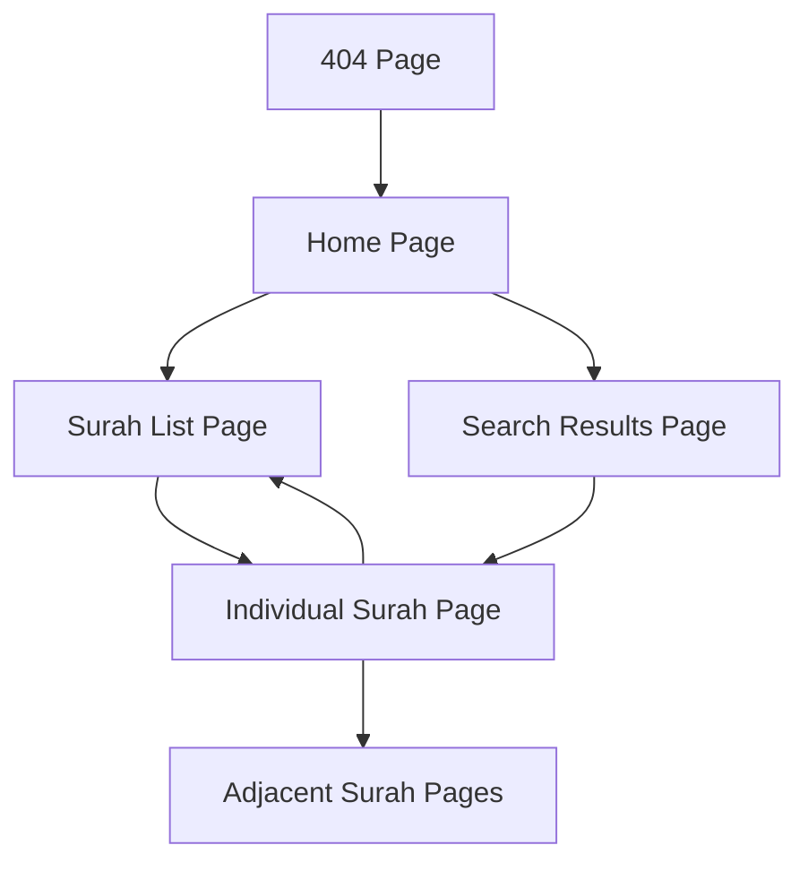

# Tafseer Iqra - Product Requirements Document

## 1. Product Overview

Tafseer Iqra is a modern web application designed to help users read, understand, and explore the Holy Quran with authentic Tafseer (interpretations). The application provides an intuitive interface for browsing all 114 Surahs, searching for specific verses, and accessing detailed explanations from renowned Islamic scholars.

The primary goal is to make Quranic knowledge accessible to Muslims worldwide through a beautiful, responsive interface that respects Islamic design principles while leveraging modern web technologies.

## 2. Core Features

### 2.1 User Roles

This application follows a single-user model without authentication requirements, making Quranic knowledge freely accessible to all visitors.

| Role | Registration Method | Core Permissions |
|------|---------------------|------------------|
| Visitor | No registration required | Can browse all surahs, search content, read Tafseer, toggle dark mode |

### 2.2 Feature Module

Our Tafseer Iqra application consists of the following main pages:

1. **Home Page**: Hero section with Islamic branding, featured surahs showcase, search functionality, and quick statistics
2. **Surah List Page**: Complete listing of all 114 surahs with search and filtering capabilities
3. **Individual Surah Page**: Detailed view of specific surah with verses, translations, and Tafseer
4. **Search Results Page**: Display search results across Quranic content with relevant verses and interpretations
5. **404 Error Page**: User-friendly error handling for non-existent routes

### 2.3 Page Details

| Page Name | Module Name | Feature Description |
|-----------|-------------|---------------------|
| Home Page | Hero Section | Display Islamic branding with Arabic title, search bar, and quick statistics (114 Surahs, 6,236 Ayahs) |
| Home Page | Featured Surahs | Show first 6 surahs in card format with Arabic names, English translations, ayah counts, and revelation type |
| Home Page | Navigation Header | Include app logo, dark mode toggle, and primary navigation to surah listing |
| Home Page | Features Section | Highlight key features: Authentic Tafseer, Smart Search, Personal Library |
| Surah List Page | Surah Grid | Display all 114 surahs in responsive card layout with search filtering |
| Surah List Page | Search Functionality | Filter surahs by Arabic name, English name, translation, or surah number |
| Surah List Page | Surah Cards | Show surah number, Arabic name, English name, translation, ayah count, revelation type |
| Individual Surah Page | Surah Header | Display surah information, navigation controls, and reading options |
| Individual Surah Page | Verses Display | Show Arabic text, transliteration, translation, and verse numbers |
| Individual Surah Page | Tafseer Section | Provide detailed interpretations and explanations for each verse |
| Search Results Page | Search Interface | Allow users to search across all Quranic content |
| Search Results Page | Results Display | Show matching verses with context and relevant Tafseer excerpts |
| 404 Error Page | Error Handling | Provide user-friendly error message with navigation back to home |

## 3. Core Process

**Main User Flow:**
1. User visits homepage and sees featured surahs and search options
2. User can either browse all surahs via "Browse Surahs" button or search for specific content
3. From surah listing, user can filter/search and select a specific surah
4. Individual surah page displays verses with translations and Tafseer
5. User can navigate between surahs or return to main listing

**Search Flow:**
1. User enters search query on homepage or surah listing page
2. System searches across Arabic text, translations, and Tafseer content
3. Results page displays matching verses with context
4. User can click on results to view full surah context

## 4. User Interface Design

### 4.1 Design Style

- **Primary Colors**: Islamic green gradient (#10b981 to #059669), gold accents (#f59e0b)
- **Secondary Colors**: Muted backgrounds, soft grays for text hierarchy
- **Button Style**: Rounded corners with gradient backgrounds, hover animations
- **Typography**: Arabic text with traditional fonts, English text with modern sans-serif (system fonts)
- **Layout Style**: Card-based design with Islamic geometric patterns as subtle backgrounds
- **Icons**: Lucide React icons with Islamic symbols (Book, Heart, Search, Moon/Sun)
- **Animations**: Smooth transitions, hover effects, and gradient animations

### 4.2 Page Design Overview

| Page Name | Module Name | UI Elements |
|-----------|-------------|-------------|
| Home Page | Hero Section | Large Arabic title with gradient text, centered layout, Islamic pattern background overlay |
| Home Page | Featured Surahs | 3-column responsive grid, Islamic-themed cards with gradient number badges |
| Home Page | Navigation | Sticky header with logo, dark mode toggle, gradient buttons |
| Surah List Page | Surah Grid | 4-column responsive grid, hover animations, revelation type badges |
| Surah List Page | Search Bar | Prominent search input with search icon, real-time filtering |
| Individual Surah Page | Verse Display | Clean typography hierarchy, Arabic text right-aligned, translation below |
| Individual Surah Page | Tafseer Section | Expandable sections, scholarly attribution, easy-to-read formatting |

### 4.3 Responsiveness

The application is designed mobile-first with responsive breakpoints:
- **Mobile (320px-768px)**: Single column layout, touch-optimized buttons, collapsible navigation
- **Tablet (768px-1024px)**: 2-column grid for surahs, optimized for portrait and landscape
- **Desktop (1024px+)**: Full multi-column layouts, hover effects, larger typography
- **Touch Optimization**: Larger tap targets, swipe gestures for navigation between surahs