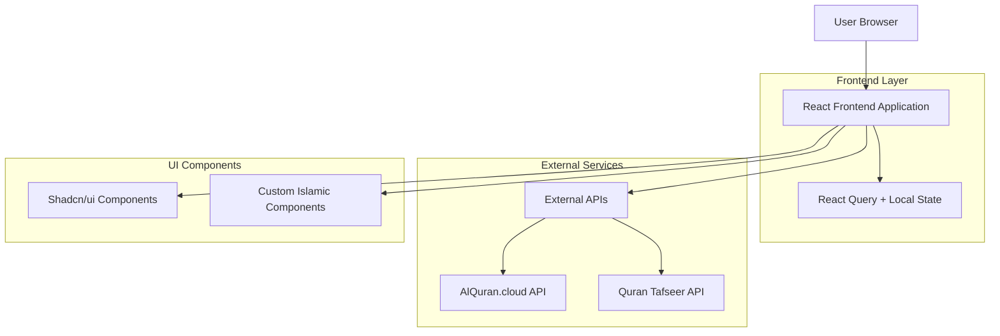
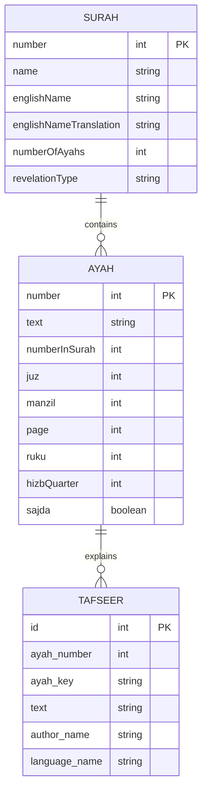

# Tafseer Iqra - Technical Architecture Document

## 1. Architecture Design



## 2. Technology Description

- **Frontend**: React@18 + TypeScript + Vite
- **Styling**: Tailwind CSS@3 + Custom Islamic Themes
- **UI Components**: Shadcn/ui + Radix UI primitives
- **State Management**: React Query@5 + React Hooks
- **Routing**: React Router DOM@6
- **Icons**: Lucide React
- **Build Tool**: Vite
- **Package Manager**: npm/bun

## 3. Route Definitions

| Route | Purpose |
|-------|----------|
| / | Home page with featured surahs and search functionality |
| /surah | Complete listing of all 114 surahs with filtering |
| /surah/:id | Individual surah page with verses and Tafseer (MISSING - needs implementation) |
| /search | Search results page for Quranic content (MISSING - needs implementation) |
| * | 404 error page for non-existent routes |

## 4. API Definitions

### 4.1 Core API Integrations

**AlQuran.cloud API**
```
GET https://api.alquran.cloud/v1/surah/{surahNumber}
```
Response: Complete surah data with Arabic text and metadata

**Translation API**
```
GET https://api.alquran.cloud/v1/surah/{surahNumber}/{edition}
```
Parameters:
| Param Name | Param Type | isRequired | Description |
|------------|------------|------------|-------------|
| surahNumber | number | true | Surah number (1-114) |
| edition | string | false | Translation edition (default: 'en.asad') |

**Tafseer API**
```
GET http://api.quran-tafseer.com/tafseer/{source}/{surah}/{ayah}
```
Parameters:
| Param Name | Param Type | isRequired | Description |
|------------|------------|------------|-------------|
| source | number | true | Tafseer source ID |
| surah | number | true | Surah number |
| ayah | number | true | Ayah number |

**Search API**
```
GET https://api.alquran.cloud/v1/search/{query}/all/en
```
Parameters:
| Param Name | Param Type | isRequired | Description |
|------------|------------|------------|-------------|
| query | string | true | Search query (URL encoded) |

## 5. Data Model

### 5.1 Data Model Definition



### 5.2 TypeScript Interfaces

**Core Data Types**
```typescript
interface Surah {
  number: number;
  name: string;
  englishName: string;
  englishNameTranslation: string;
  numberOfAyahs: number;
  revelationType: string;
}

interface Ayah {
  number: number;
  text: string;
  numberInSurah: number;
  juz: number;
  manzil: number;
  page: number;
  ruku: number;
  hizbQuarter: number;
  sajda: boolean;
}

interface TafseerResponse {
  code: number;
  status: string;
  data: {
    ayah_number: number;
    ayah_key: string;
    text: string;
    surah: {
      id: number;
      name: string;
      english_name: string;
      revelation_place: string;
      verses_count: number;
    };
    tafseer: {
      id: number;
      name: string;
      author_name: string;
      language_name: string;
      text: string;
    };
  };
}
```

## 6. Component Architecture

### 6.1 Component Hierarchy

```
App
├── Router
│   ├── Index (Homepage)
│   │   ├── Header
│   │   ├── HeroSection
│   │   ├── FeaturedSurahs
│   │   ├── FeaturesSection
│   │   └── Footer
│   ├── SurahListPage
│   │   ├── Header
│   │   ├── SearchInput
│   │   └── SurahGrid
│   │       └── IslamicCard[]
│   ├── SurahDetailPage (MISSING)
│   │   ├── SurahHeader
│   │   ├── VersesSection
│   │   └── TafseerSection
│   ├── SearchResultsPage (MISSING)
│   │   ├── SearchInterface
│   │   └── ResultsList
│   └── NotFound
└── Providers
    ├── QueryClientProvider
    ├── TooltipProvider
    └── ThemeProvider
```

### 6.2 Custom Components

- **IslamicCard**: Enhanced card component with Islamic patterns and styling
- **SearchInput**: Search input with integrated search icon
- **GradientButton**: Buttons with Islamic-themed gradients
- **ArabicText**: Specialized component for Arabic text rendering

## 7. Current Issues and Required Fixes

### 7.1 Critical Issues

1. **Missing Routes**: Individual surah pages (/surah/:id) and search results (/search) return 404 errors
2. **Incomplete Data**: SURAHS array only contains 10 out of 114 surahs
3. **API Integration**: Tafseer API integration not fully implemented
4. **Error Handling**: Limited error handling for API failures

### 7.2 UI/UX Improvements Needed

1. **Loading States**: Add skeleton loaders for API calls
2. **Error Boundaries**: Implement React error boundaries
3. **Accessibility**: Add ARIA labels and keyboard navigation
4. **Performance**: Implement lazy loading for large surah content
5. **Offline Support**: Add service worker for offline reading

### 7.3 Technical Debt

1. **Type Safety**: Some API responses lack proper TypeScript typing
2. **Code Splitting**: Implement route-based code splitting
3. **Testing**: No unit or integration tests currently implemented
4. **Documentation**: Missing inline code documentation

## 8. Deployment Configuration

### 8.1 Build Configuration

- **Development**: `npm run dev` - Vite dev server with HMR
- **Production**: `npm run build` - Optimized build with tree shaking
- **Preview**: `npm run preview` - Preview production build locally

### 8.2 Environment Variables

No sensitive environment variables required as all APIs are public. Consider adding:
- `VITE_API_BASE_URL` for API endpoint configuration
- `VITE_ANALYTICS_ID` for usage tracking

### 8.3 Hosting Recommendations

- **Vercel**: Optimal for React/Vite applications with automatic deployments
- **Netlify**: Good alternative with form handling capabilities
- **GitHub Pages**: Free option for open-source projects

All hosting platforms support static site deployment with client-side routing configuration.